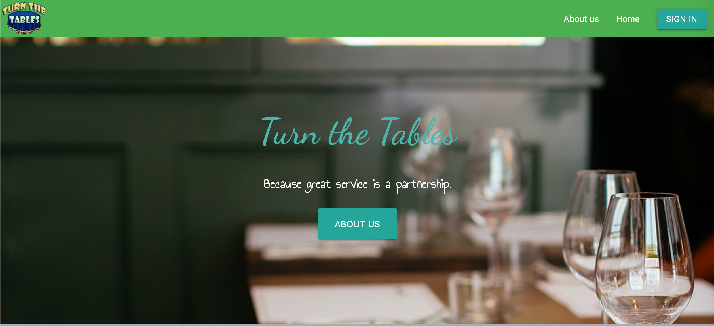
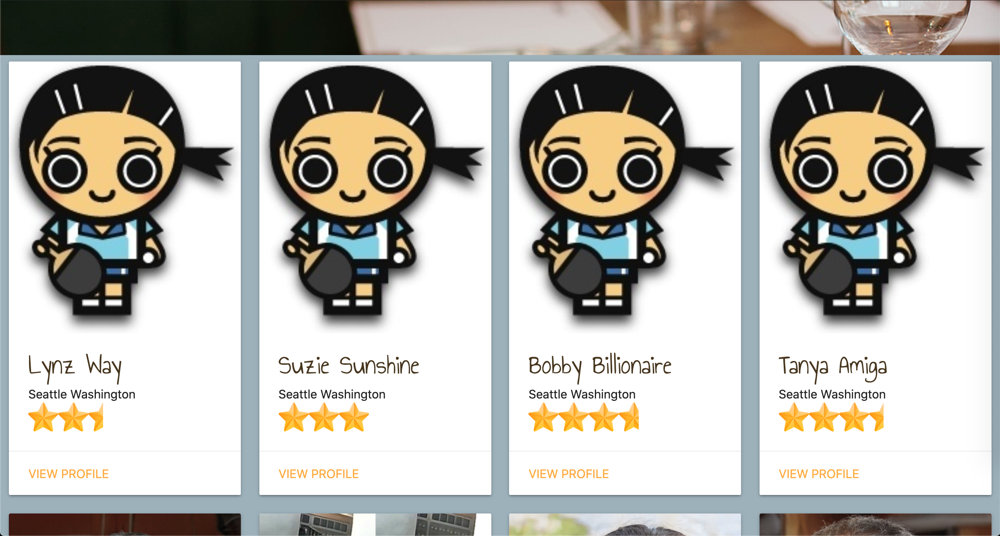

# Turn the Tables

## Table of Contents
1. [Description](#description)
2. [Authors](#authors)
3. [Technologies](#technologies)
4. [Installation](#installation)
5. [Usage](#usage)
6. [Contributing](#contributing)
7. [Tests](#tests)
8. [Questions](#questions)
9. [License](#license)

## Description
A Node/Express/Sequelize/Handlebars app that inverts the traditional reviews site model.  We allow businesses to create and review their customers. The higher their rating, the more access to customer rewards. Turn the Tables, when fully developed, will provide an avenue for businesses and guests to build a better rapport, by offering rewards, educational resources, and even conflict resolution (when needed.)

In the most current build, businesses can create a profile, then log in to create customers, create reviews for customers, update and delete those reviews and customers. In the next build, "claimed" customers will be also able to log in to edit their profile info, comment on reviews left about them, and message to the business to open a discussion about their reviews, and receive rewards from multiple businesses.

## Deployed Application

* View the deployed application on [Heroku](http://bit.ly/turn-the-tables-app)
* View it on mobile by scanning the QR Code below:

=============================

### Winner of Best Presentation award for the Winter 2020/21 University of Washington coding bootcamp.

[Turn the Tables Presentation](./assets/TTT-Presentation.png)

=============================
## Authors

| Name | Email  | Github  | LinkedIn |
| :--: | :----: | :-----: | :------: |
| Benjamin Hopkins | bjhops17@gmail.com |  |  |
| Timothy M. Keller | timothy.m.keller@gmail.com |  |  |
| Kevin Lyons | Zinckev@hotmail.com |  |  |
| S.D. Mulaney | -- |  |  |
 
 

## Technologies

## Installation
Navigate to your chosen directory and clone the git repository. Type npm i to install all dependencies (bcrypt, dotenv, express, express-handlebars, express-session, express-sessions, mysql2, and sequelize). Create a database in MySQL Workbench called turn_tables_db. Optionally you can use our seed-turn_tables_db.sql to add reviews, businesses, and customers to play with!

## Usage
Navigate to the installation directory, open up terminal or command prompt, and run node server.js or npm start. To create a business, navigate to the sign-in button in the top right, and click "Don't have an account?".
 
 

 
 
 Fill in your information, and click enter. Sign in by clicking on sign-in again and entering your email and password. You'll be redirected to your business profile, which you can access at any time by clicking the top right button, then "Business profile." Once there you can create users, write reviews for them, and edit/delete your own reviews. You also don't need to be logged in to view reviews on the homepage.
  
  

## Contributing
[Fork us](https://github.com/tmkeller/eightysixed-app) on Github, and please message us about pull requests.

## Tests
No testing suite is designated at this time.

## Questions
Contact [bh007183](https://github.com/bh007183), [tmkeller](https://github.com/tmkeller), [Lax-Walrus](https://github.com/lax-walrus, and [seagda](https://github.com/seagda) on Github.

## License
You agree that this repository, its contents, elements, and as well as underlying concept and structure, are covered [under a GPLv3 license](https://www.gnu.org/licenses/gpl-3.0.txt). Code may be downloaded, modified, and/or distributed solely for non-commerical, personal, or educational purposes. Any and all derivatives must similarly be used solely for non-commerical, personal, or educational purposes. Copyleft 2021 by the [Authors](#authors)